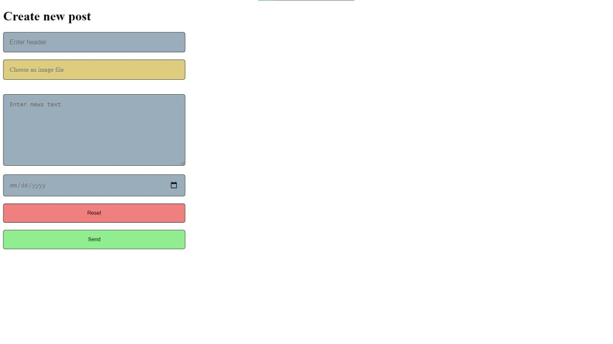

Simple CRUD news site. 
On /posts you can see news posts. 
On /admin you can add/update/delete news post. 

Screenshots: 

Used technologies
* Java
* Spring Boot
* - Core
* - MVC
* - Security (http basic)
* JDBC
* git
* Maven
* Docker, Docker-compose
* SQL (Postgres)
* JUnit